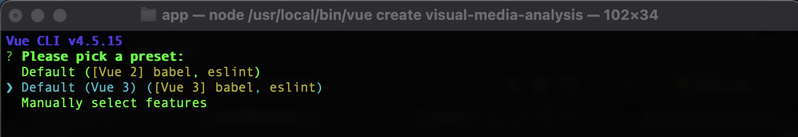
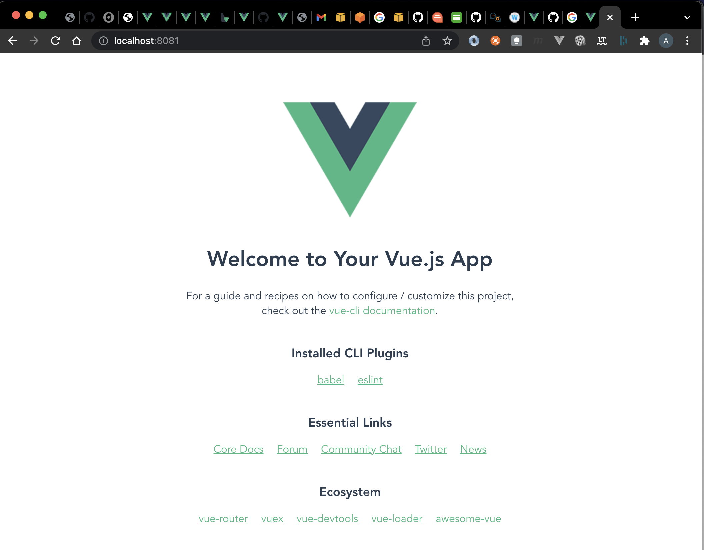

# Create an app with a video player

## Create a vue-cli project

1. Clone this git repository

    ```
    git clone https://github.com/aburkleaux/visual-media-analysis.git
    ```

2. Use the instructions from the vue-cli [Create Project](https://cli.vuejs.org/guide/creating-a-project.html#vue-create) page to create a new vue-cli project called `visual-media-analysis`.

    ```
    vue create app
    ```

3. Select the default configuration for the app.

    


## Test the web page

1. Start a development web server

    ```
    cd app
    npm run serve
    ```

2. Open your browser to http://localhost:8080/ (or the location specified by the output of the `npm run serve` command)

    


