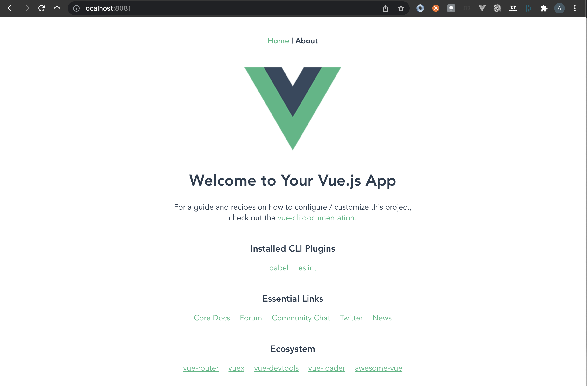

# Add a video player to the app

We are going to replace the Hello-World component in the app with a videojs video player component and configure some new settings for the player.

## Add a router to the app

First, we are going to add a router to the app.  A router will enable us to serve test videos from within the project and will let us have multiple views within the single page app.

1. Use the vue-cli add command to add a router to the project.

    ```
    vue add router
    ```

2. Take a moment to explore the changes to the app. The app now has two views 1) **About** and 2) **Home** that you can load using the links at the top of the web page.

    

## Add a VideoPlayer component

1. Install the video.js package 

    ```
    npm install video.js
    ```

2. Replace the Hello-World compnent with the VideoPlayer component in Home.vue

<add a diff here>

## Add the sample video to the router


